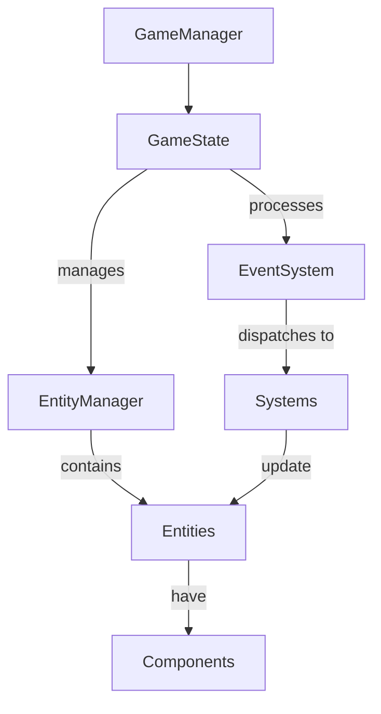

# System Patterns

This document outlines the core architecture and design patterns used in The Machines of God.

## Architecture Overview

The game follows a hybrid architecture combining elements of:
- State-based game management
- Entity Component System (lightweight implementation)
- Event-driven communication



## Core Systems

### State Management

The game uses a state machine pattern to manage different game states:

```python
class GameState:
    def handle_event(self, event):
        # State-specific event handling
        pass
        
    def update(self, dt):
        # State-specific logic update
        pass
        
    def render(self, screen):
        # State-specific rendering
        pass
```

Game states include:
- **MenuState**: Main menu and UI navigation
- **PlayingState**: Active gameplay
- **ShopState**: Upgrade purchasing interface
- **PausedState**: Game paused
- **GameOverState**: End of game flow

State transitions are managed by the Game class which acts as the state machine controller.

### Entity Management

Entities are the core game objects that exist in the game world. The base entity structure:

```python
class Entity:
    def __init__(self, x, y):
        self.x = x
        self.y = y
        self.rect = pygame.Rect(x, y, width, height)
        # Other common properties
        
    def update(self, dt):
        # Update entity state
        pass
        
    def render(self, screen):
        # Render entity
        pass
```

Key entity types:
- **Player**: Player-controlled spacecraft
- **Enemy**: Various enemy types with different behaviors
- **Projectile**: Weapons fire from player or enemies
- **Collectible**: Items that can be collected by the player
- **Effect**: Visual effects like explosions or particles

Each entity type extends the base Entity class with specific behaviors.

### Component System

The game uses a lightweight component approach for entities with specialized behavior:

```python
class Component:
    def __init__(self, owner):
        self.owner = owner
        
    def update(self, dt):
        # Update component state
        pass
```

Key components include:
- **MovementComponent**: Handles entity movement patterns
- **HealthComponent**: Manages entity health and damage
- **CollisionComponent**: Handles collision detection
- **WeaponComponent**: Manages firing capabilities

### Collision System

Collision detection uses a combination of:
- Rect-based collision for efficiency
- Group-based collision checking through pygame.sprite.groupcollide
- Custom collision resolution based on entity types

```python
def _check_collisions(self):
    # Check player projectiles against enemies
    hits = pygame.sprite.groupcollide(
        self.projectile_group, self.enemy_group, True, False
    )
    
    # Process hits and apply damage
    for projectile, enemies in hits.items():
        for enemy in enemies:
            enemy.take_damage(projectile.damage)
            # Create visual effects
            # Add score
```

### Event System

The game uses Pygame's event system with custom event types:

```python
# Custom event definition
ENEMY_KILLED = pygame.USEREVENT + 1
PLAYER_DIED = pygame.USEREVENT + 2
LEVEL_COMPLETED = pygame.USEREVENT + 3

# Posting an event
pygame.event.post(pygame.event.Event(ENEMY_KILLED, {"enemy": enemy}))

# Handling events
for event in pygame.event.get():
    if event.type == ENEMY_KILLED:
        # Process enemy killed event
```

## Gameplay Systems

### Wave System

The wave system manages enemy spawning and level progression:

```python
class WaveManager:
    def __init__(self):
        self.current_wave = 0
        self.enemies_to_spawn = 0
        self.spawn_timer = 0
        self.wave_data = []
        
    def update(self, dt):
        # Update spawn timer
        # Spawn enemies when timer triggers
        # Advance waves when complete
```

Current implementation spawns enemies in predefined patterns with increasing difficulty.

Future enhancements:
- Formation-based spawning with coordinated movement
- Wave templates with varied enemy compositions
- Dynamic difficulty adjustment

### Upgrade System

The upgrade system allows players to purchase improvements:

```python
class UpgradeSystem:
    def __init__(self, player):
        self.player = player
        self.available_upgrades = []
        
    def purchase_upgrade(self, upgrade_id):
        # Apply upgrade to player
        # Deduct currency
```

Upgrade categories:
- Weapon upgrades (damage, fire rate, patterns)
- Defense upgrades (health, shields)
- Movement upgrades (speed, handling)
- Special abilities (missiles, bombs)

### Save System

The save system persists game state between sessions:

```python
def save_game(self):
    save_data = {
        "player": {
            "score": self.player.score,
            "lives": self.player.lives,
            # Other player attributes
        },
        "game_state": {
            "current_level": self.current_level,
            "stars_collected": self.stars_collected,
            # Other game state info
        },
        "upgrades": self.shop_state.get_purchased_upgrades()
    }
    
    with open("data/save_data.json", "w") as f:
        json.dump(save_data, f)
```

The system saves:
- Player stats and attributes
- Game progress
- Purchased upgrades
- Currency and collectibles

## Planned Architectural Improvements

### Formation System

```python
class FormationManager:
    def __init__(self):
        self.active_formations = []
        self.formation_templates = {
            "v_shape": [(-2, -2), (-1, -1), (0, 0), (1, -1), (2, -2)],
            "line": [(0, i) for i in range(5)],
            "circle": [(math.cos(i*math.pi/4), math.sin(i*math.pi/4)) for i in range(8)],
            "square": [(x, y) for x in [-1, 1] for y in [-1, 1]],
            "diamond": [(0, -2), (-2, 0), (0, 2), (2, 0)],
            "x_formation": [(-1, -1), (1, -1), (0, 0), (-1, 1), (1, 1)],
            "wall": [(x, 0) for x in range(-3, 4)],
            "arrow": [(0, -2), (-1, -1), (0, -1), (1, -1), (-2, 0), (-1, 0), (0, 0), (1, 0), (2, 0)]
        }
        
    def create_formation(self, formation_type, enemy_type, position, behavior="static", difficulty=1.0):
        """Creates a new enemy formation with the specified behavior
        
        Args:
            formation_type (str): Type of formation ("v_shape", "line", etc.)
            enemy_type (str): Type of enemies to create
            position (tuple): Center position of the formation
            behavior (str): Formation behavior type
            difficulty (float): Difficulty multiplier for enemies
            
        Returns:
            list: List of created enemy sprites
        """
        if formation_type not in self.formation_templates:
            return []
            
        template = self.formation_templates[formation_type]
        enemies = []
        
        for offset_x, offset_y in template:
            x = position[0] + offset_x * 40
            y = position[1] + offset_y * 40
            
            # Create enemy using factory
            enemy = EntityFactory.create_enemy(enemy_type, x, y, difficulty=difficulty)
            if enemy:
                enemy.formation_data = {
                    "type": formation_type,
                    "behavior": behavior,
                    "offset": (offset_x, offset_y),
                    "center": position,
                    "time": 0
                }
                enemies.append(enemy)
            
        formation = {
            "type": formation_type,
            "behavior": behavior,
            "enemies": enemies,
            "center": position,
            "angle": 0,
            "time": 0
        }
        
        self.active_formations.append(formation)
        return enemies
    
    def update(self, dt):
        """Update all active formations
        
        Args:
            dt (float): Time elapsed since last update
        """
        for formation in self.active_formations[:]:
            # Update formation timer
            formation["time"] += dt
            
            # Check if formation is still active
            active_enemies = [e for e in formation["enemies"] if e.alive()]
            if not active_enemies:
                self.active_formations.remove(formation)
                continue
                
            # Update formation center position based on behavior
            if formation["behavior"] == "static":
                # Basic downward movement
                formation["center"] = (
                    formation["center"][0],
                    formation["center"][1] + 50 * dt
                )
            elif formation["behavior"] == "rotate":
                # Rotate around center while moving down
                formation["angle"] += 45 * dt  # 45 degrees per second
                formation["center"] = (
                    formation["center"][0],
                    formation["center"][1] + 30 * dt
                )
            elif formation["behavior"] == "wave":
                # Sine wave horizontal movement while moving down
                amplitude = 100
                frequency = 0.5
                formation["center"] = (
                    formation["center"][0] + math.sin(formation["time"] * frequency) * amplitude * dt,
                    formation["center"][1] + 40 * dt
                )
            elif formation["behavior"] == "split":
                # Formation splits in half after a delay
                if formation["time"] > 3.0:  # After 3 seconds
                    split_factor = min((formation["time"] - 3.0) * 0.5, 1.0)  # Gradual split
                    
                    for enemy in active_enemies:
                        offset_x, offset_y = enemy.formation_data["offset"]
                        # Apply horizontal split based on x offset
                        split_dir = 1 if offset_x >= 0 else -1
                        enemy.formation_data["offset"] = (
                            offset_x + split_dir * split_factor,
                            offset_y
                        )
                
                formation["center"] = (
                    formation["center"][0],
                    formation["center"][1] + 40 * dt
                )
            elif formation["behavior"] == "converge":
                # Enemies move toward center, then continue downward
                converge_time = 2.0
                if formation["time"] < converge_time:
                    converge_factor = formation["time"] / converge_time
                    
                    for enemy in active_enemies:
                        offset_x, offset_y = enemy.formation_data["offset"]
                        enemy.formation_data["offset"] = (
                            offset_x * (1 - converge_factor),
                            offset_y * (1 - converge_factor)
                        )
                
                formation["center"] = (
                    formation["center"][0],
                    formation["center"][1] + 40 * dt
                )
            
            # Apply formation positions to enemies
            for enemy in active_enemies:
                offset_x, offset_y = enemy.formation_data["offset"]
                
                if formation["behavior"] == "rotate":
                    # Apply rotation to offset
                    angle_rad = math.radians(formation["angle"])
                    rotated_x = offset_x * math.cos(angle_rad) - offset_y * math.sin(angle_rad)
                    rotated_y = offset_x * math.sin(angle_rad) + offset_y * math.cos(angle_rad)
                    offset_x, offset_y = rotated_x, rotated_y
                
                # Calculate final position
                enemy.rect.centerx = formation["center"][0] + offset_x * 40
                enemy.rect.centery = formation["center"][1] + offset_y * 40
                
                # Update enemy formation time
                enemy.formation_data["time"] = formation["time"]
```

### ParallaxBackground System

```python
class ParallaxBackground:
    def __init__(self, screen_width, screen_height):
        """Initialize parallax background system
        
        Args:
            screen_width (int): Width of the screen
            screen_height (int): Height of the screen
        """
        self.screen_width = screen_width
        self.screen_height = screen_height
        self.layers = []
        
        # Create star layers with different speeds
        self._create_star_layers()
        
        # Create nebula layer
        self._create_nebula_layer()
        
    def _create_star_layers(self):
        """Create star background layers"""
        # Distant stars (slowest)
        stars_distant = []
        for _ in range(50):
            x = random.randint(0, self.screen_width)
            y = random.randint(0, self.screen_height)
            stars_distant.append({
                "x": x, 
                "y": y, 
                "size": 1, 
                "color": (150, 150, 200)
            })
        
        # Mid-distance stars
        stars_mid = []
        for _ in range(75):
            x = random.randint(0, self.screen_width)
            y = random.randint(0, self.screen_height)
            stars_mid.append({
                "x": x, 
                "y": y, 
                "size": 2, 
                "color": (200, 200, 255)
            })
            
        # Close stars (fastest)
        stars_close = []
        for _ in range(50):
            x = random.randint(0, self.screen_width)
            y = random.randint(0, self.screen_height)
            stars_close.append({
                "x": x, 
                "y": y, 
                "size": 3, 
                "color": (255, 255, 255)
            })
        
        self.layers.append({"objects": stars_distant, "speed": 10, "type": "stars"})
        self.layers.append({"objects": stars_mid, "speed": 20, "type": "stars"})
        self.layers.append({"objects": stars_close, "speed": 30, "type": "stars"})
    
    def _create_nebula_layer(self):
        """Create nebula cloud layer"""
        nebulae = []
        for _ in range(3):
            x = random.randint(0, self.screen_width)
            y = random.randint(0, self.screen_height)
            size = random.randint(100, 300)
            color = (
                random.randint(50, 150),
                random.randint(50, 150),
                random.randint(150, 250),
                random.randint(30, 80)  # Alpha
            )
            nebulae.append({
                "x": x, 
                "y": y, 
                "size": size, 
                "color": color
            })
        
        self.layers.append({"objects": nebulae, "speed": 5, "type": "nebula"})
        
    def update(self, dt):
        """Update background layers
        
        Args:
            dt (float): Time elapsed since last update
        """
        # Update each layer
        for layer in self.layers:
            for obj in layer["objects"]:
                # Move objects down
                obj["y"] += layer["speed"] * dt
                
                # Wrap around screen
                if obj["y"] - obj["size"] > self.screen_height:
                    obj["y"] = -obj["size"]
                    obj["x"] = random.randint(0, self.screen_width)
                    
    def render(self, screen):
        """Render background to screen
        
        Args:
            screen (pygame.Surface): Surface to render to
        """
        for layer in self.layers:
            if layer["type"] == "stars":
                for obj in layer["objects"]:
                    pygame.draw.circle(
                        screen, 
                        obj["color"], 
                        (int(obj["x"]), int(obj["y"])), 
                        obj["size"]
                    )
                    
            elif layer["type"] == "nebula":
                for obj in layer["objects"]:
                    # Create a surface with alpha for the nebula
                    size = obj["size"]
                    nebula_surface = pygame.Surface((size*2, size*2), pygame.SRCALPHA)
                    
                    # Draw nebula cloud as a gradient circle
                    for radius in range(size, 0, -10):
                        alpha = int(255 * (radius/size))
                        color = obj["color"][:3] + (min(color[3], alpha),)
                        pygame.draw.circle(nebula_surface, color, (size, size), radius)
                        
                    screen.blit(nebula_surface, (int(obj["x"]-size), int(obj["y"]-size)))
```

### Obstacle System

```python
class ObstacleManager:
    def __init__(self):
        """Initialize obstacle manager"""
        self.obstacles = pygame.sprite.Group()
        self.obstacle_types = {
            "asteroid": AsteroidObstacle,
            "energy_barrier": EnergyBarrier,
            "gravity_well": GravityWell,
            "wormhole": Wormhole,
            "radiation_zone": RadiationZone
        }
        
    def create_obstacle(self, obstacle_type, x, y, **kwargs):
        """Create a new obstacle
        
        Args:
            obstacle_type (str): Type of obstacle to create
            x (int): X position
            y (int): Y position
            **kwargs: Additional arguments for specific obstacle types
            
        Returns:
            Obstacle: The created obstacle or None if type is invalid
        """
        if obstacle_type not in self.obstacle_types:
            return None
            
        obstacle_class = self.obstacle_types[obstacle_type]
        obstacle = obstacle_class(x, y, **kwargs)
        self.obstacles.add(obstacle)
        return obstacle
        
    def update(self, dt, player_group=None, enemy_group=None, projectile_group=None):
        """Update all obstacles and apply their effects
        
        Args:
            dt (float): Time elapsed since last update
            player_group (pygame.sprite.Group): Group of player sprites
            enemy_group (pygame.sprite.Group): Group of enemy sprites
            projectile_group (pygame.sprite.Group): Group of projectile sprites
        """
        # Basic update for all obstacles
        self.obstacles.update(dt)
        
        # Apply obstacle effects to entities
        for obstacle in self.obstacles:
            if hasattr(obstacle, "apply_effect"):
                if player_group:
                    obstacle.apply_effect(player_group, dt)
                if enemy_group:
                    obstacle.apply_effect(enemy_group, dt)
                if projectile_group:
                    obstacle.apply_effect(projectile_group, dt)
```

### Particle System

```python
class ParticleSystem:
    def __init__(self):
        """Initialize particle system"""
        self.particles = []
        
    def create_explosion(self, position, scale=1.0, color=(255, 165, 0)):
        """Create explosion particles
        
        Args:
            position (tuple): Center position of explosion
            scale (float): Size multiplier
            color (tuple): Base color of particles
        """
        particles_count = int(20 * scale)
        for _ in range(particles_count):
            # Random velocity vector
            angle = random.uniform(0, math.pi * 2)
            speed = random.uniform(50, 200) * scale
            velocity = (math.cos(angle) * speed, math.sin(angle) * speed)
            
            # Create particle with decay
            lifetime = random.uniform(0.2, 0.8)
            size = random.randint(2, int(6 * scale))
            particle = {
                "position": position,
                "velocity": velocity,
                "color": color,
                "size": size,
                "lifetime": lifetime,
                "max_lifetime": lifetime
            }
            self.particles.append(particle)
            
    def update(self, dt):
        """Update all particles
        
        Args:
            dt (float): Time elapsed since last update
        """
        for particle in self.particles[:]:
            # Update position
            particle["position"] = (
                particle["position"][0] + particle["velocity"][0] * dt,
                particle["position"][1] + particle["velocity"][1] * dt
            )
            
            # Update lifetime
            particle["lifetime"] -= dt
            if particle["lifetime"] <= 0:
                self.particles.remove(particle)
                
    def render(self, screen):
        """Render all particles
        
        Args:
            screen (pygame.Surface): Surface to render to
        """
        for particle in self.particles:
            # Fade alpha based on remaining lifetime
            alpha = int(255 * (particle["lifetime"] / particle["max_lifetime"]))
            color = particle["color"] + (alpha,) if len(particle["color"]) == 3 else particle["color"][:3] + (alpha,)
            
            # Draw particle
            pos = (int(particle["position"][0]), int(particle["position"][1]))
            pygame.draw.circle(screen, color, pos, particle["size"])
```

### Factory Pattern

Used for entity creation with configuration:

```python
class EntityFactory:
    @staticmethod
    def create_enemy(enemy_type, x, y, **kwargs):
        """Create an enemy of the specified type
        
        Args:
            enemy_type (str): Type of enemy to create
            x (int): X position
            y (int): Y position
            **kwargs: Additional arguments specific to enemy type
            
        Returns:
            Enemy: The created enemy or None if type is invalid
        """
        # Basic enemy types
        if enemy_type == "basic":
            return BasicEnemy(x, y, **kwargs)
        elif enemy_type == "zigzag":
            return ZigZagEnemy(x, y, **kwargs)
        elif enemy_type == "shooter":
            return ShooterEnemy(x, y, **kwargs)
        elif enemy_type == "heavy":
            return HeavyBomber(x, y, **kwargs)
        
        # Advanced enemy types
        elif enemy_type == "dart":
            return DartEnemy(x, y, **kwargs)
        elif enemy_type == "shield":
            return ShieldBearerEnemy(x, y, **kwargs)
        elif enemy_type == "teleporter":
            return TeleporterEnemy(x, y, **kwargs)
        elif enemy_type == "splitter":
            return SplitterEnemy(x, y, **kwargs)
        elif enemy_type == "pulsar":
            return PulsarEnemy(x, y, **kwargs)
        elif enemy_type == "orbital":
            return OrbitalEnemy(x, y, **kwargs)
        elif enemy_type == "minelayer":
            return MineLayerEnemy(x, y, **kwargs)
        elif enemy_type == "phase":
            return PhaseEnemy(x, y, **kwargs)
        elif enemy_type == "rammer":
            return RammerEnemy(x, y, **kwargs)
        elif enemy_type == "swarm":
            return SwarmEnemy(x, y, **kwargs)
            
        return None
        
    @staticmethod
    def create_projectile(projectile_type, x, y, direction, **kwargs):
        """Create a projectile of the specified type
        
        Args:
            projectile_type (str): Type of projectile
            x (int): X position
            y (int): Y position
            direction (tuple): Direction vector (x, y)
            **kwargs: Additional arguments specific to projectile type
            
        Returns:
            Projectile: The created projectile or None if type is invalid
        """
        if projectile_type == "player_bullet":
            return PlayerProjectile(x, y, direction[0], direction[1], **kwargs)
        elif projectile_type == "enemy_bullet":
            return EnemyProjectile(x, y, **kwargs)
        elif projectile_type == "missile":
            return PlayerMissile(x, y, direction[0], direction[1], **kwargs)
        elif projectile_type == "mine":
            return Mine(x, y, **kwargs)
        elif projectile_type == "energy_wave":
            return EnergyWave(x, y, **kwargs)
            
        return None
    
    @staticmethod
    def create_obstacle(obstacle_type, x, y, **kwargs):
        """Create an obstacle of the specified type
        
        Args:
            obstacle_type (str): Type of obstacle
            x (int): X position
            y (int): Y position
            **kwargs: Additional arguments specific to obstacle type
            
        Returns:
            Obstacle: The created obstacle or None if type is invalid
        """
        if obstacle_type == "asteroid":
            size = kwargs.get("size", random.choice(["small", "medium", "large"]))
            return AsteroidObstacle(x, y, size)
        elif obstacle_type == "energy_barrier":
            width = kwargs.get("width", 200)
            height = kwargs.get("height", 20)
            return EnergyBarrier(x, y, width, height)
        elif obstacle_type == "gravity_well":
            radius = kwargs.get("radius", 150)
            strength = kwargs.get("strength", 100)
            return GravityWell(x, y, radius, strength)
        elif obstacle_type == "wormhole":
            radius = kwargs.get("radius", 30)
            exit_pos = kwargs.get("exit_pos", None)
            return Wormhole(x, y, radius, exit_pos)
        elif obstacle_type == "radiation_zone":
            width = kwargs.get("width", 200)
            height = kwargs.get("height", 200)
            damage = kwargs.get("damage", 5)
            return RadiationZone(x, y, width, height, damage)
            
        return None
```

## Implementation Priority

Current focus areas:
1. Enemy Formation System
2. Visual Feedback Enhancements (Particle System)
3. Advanced Player Controls
4. Resource Management

Next phase:
1. Animation System
2. Enhanced Collectible System
3. Trade-off Based Upgrades
4. Sound Framework
5. Story Mode Structure 